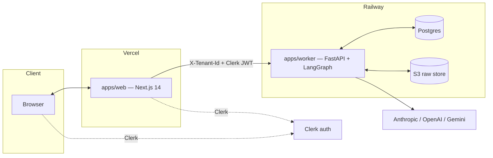
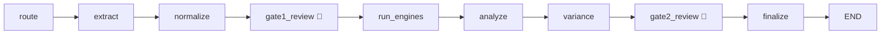
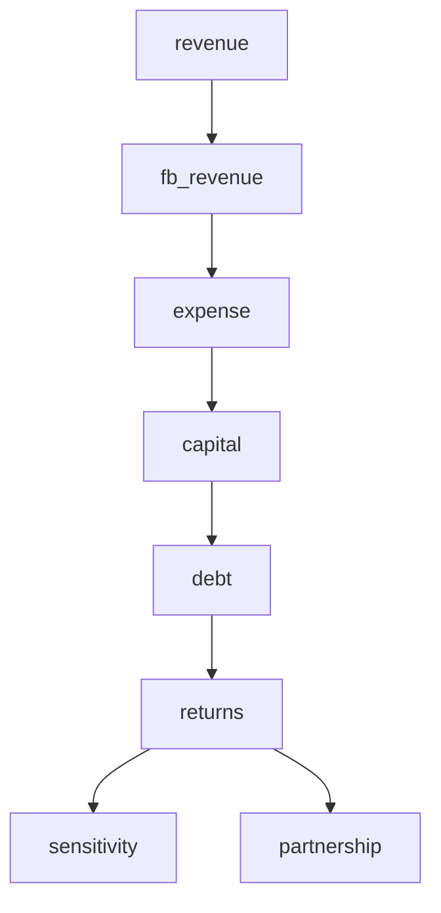

# Fondok — Architecture

> AI-powered hotel-acquisition underwriting: from an offering memorandum to a
> fully-cited IC memo with live IRR, variance vs. the broker case, and
> exportable deliverables.

This is the single reference for how Fondok is built — the services, the
underwriting pipeline, the engines, the provenance spine, the data model, and
how it all deploys. Kept in sync with the code; when underwriting behavior
changes, update this **and** `apps/web/src/app/methodology/page.tsx`.

**Sibling docs:** calc reference → `docs/HOW_FONDOK_CALCULATES.md` · ops →
`docs/RUNBOOK.md` · roadmap → `docs/ROADMAP.md` · live methodology page →
`/methodology`.

---

## 1. System overview

A **pnpm monorepo** with two deployable services plus a shared schema contract:



- **`apps/web`** — analyst-facing Next.js app on Vercel (`fondok-app.vercel.app`).
- **`apps/worker`** — FastAPI + LangGraph "brain" on Railway; owns all extraction,
  the deterministic engines, and persistence.
- **`packages/schemas-py`** (Pydantic) is the **source of truth** for every typed
  payload; **`packages/schemas-ts`** (Zod) mirrors it for the web app.

The web app holds almost no business logic — it's a rich reader/editor over the
worker's outputs. All modeling is deterministic and lives in the worker; there
are **no LLM calls in the math path**.

---

## 2. Monorepo layout

```
fondok/
├── apps/
│   ├── web/                 Next.js 14 app (Vercel)
│   │   └── src/
│   │       ├── app/         routes: dashboard, projects/[id], pipeline,
│   │       │                data-library, audit, admin/cost, methodology,
│   │       │                pipeline-digests, settings, sign-in/up
│   │       ├── components/  project/ tab system + engine panels + provenance
│   │       ├── lib/         api.ts, auth.ts, provenance.ts, format, glossary
│   │       └── stores/
│   └── worker/              FastAPI + LangGraph (Railway, Docker)
│       └── app/
│           ├── main.py          FastAPI entrypoint
│           ├── graph.py         LangGraph DealState machine
│           ├── state.py         DealState
│           ├── agents/          LLM agents (router, extractor, analyst, …)
│           ├── engines/         deterministic underwriting engines
│           ├── services/        engine_runner, pipeline, usali_scorer, …
│           ├── extraction/      parser, chunking, embeddings, field_catalog
│           ├── api/             FastAPI routers (deals, documents, analysis…)
│           ├── auth/            Clerk JWT + tenant resolution
│           ├── storage/         S3 raw store
│           ├── streaming/       SSE (memo stream)
│           ├── export/          xlsx / pdf / pptx
│           └── migrations.py    idempotent cold-start migrations
├── packages/
│   ├── schemas-py/          fondok_schemas — Pydantic (source of truth)
│   └── schemas-ts/          Zod mirror consumed by the web app
├── evals/                   extraction + engine eval harness (golden set)
├── infra/ · scripts/        deploy + ops tooling
├── railway.toml · vercel.json · .github/workflows/
```

---

## 3. The underwriting pipeline (LangGraph)

The heart of the worker is a **LangGraph state machine** over a `DealState`
(`app/graph.py`, `app/state.py`). A deal flows through nine nodes with two
human-in-the-loop (HITL) gates:



| Node | What it does |
|---|---|
| **route** | Router agent classifies each uploaded doc (OM, T-12, PNL, PNL_MONTHLY, STR, CBRE…) |
| **extract** | Extractor agent pulls typed fields per doc into the terse schema, citing source pages |
| **normalize** | Normalizer maps extracted fields → canonical assumptions; USALI mapping; tags `__sources__` |
| **gate1_review** 🚦 | HITL: analyst accepts/edits the normalized spread before modeling |
| **run_engines** | Runs the deterministic engine chain in dependency order |
| **analyze** | Analyst + Critic agents draft the IC narrative + risk findings |
| **variance** | Variance agent flags where Fondok's read diverges from the broker case |
| **gate2_review** 🚦 | HITL: analyst signs off before the memo is finalized |
| **finalize** | Assemble the cited IC memo + exportables |

**Agents** (`app/agents/`, LLM-backed): `router`, `extractor`, `normalizer`,
`analyst` / `analyst_batch`, `critic`, `variance`, `researcher`, `qa_resolver`
(resolves seller Q&A into field overrides), `due_diligence`.

**Model routing** — a router picks the cheapest model that meets each task's
quality bar (a Haiku-class classifier, a Sonnet-class extractor, an Opus-class
memo synthesizer); prompt caching cuts repeated-context cost on extraction
re-runs and memo regeneration. Per-call tokens/cost are persisted (§11). Traces
go to LangSmith.

The gates are why "17 minutes" is realistic without being reckless — nothing
reaches the memo without an analyst accepting the spread (Gate 1) and the
conclusions (Gate 2).

---

## 4. Extraction subsystem

`app/extraction/` turns raw broker files into typed fields. The document status
lifecycle is `UPLOADED → CLASSIFYING → EXTRACTING → EXTRACTED` (or `FAILED` /
`PARSE_FAILED`), run as a background task after a synchronous byte-write to S3.

- **parser.py** — PDF via LlamaParse (when configured) or PyMuPDF + pdfplumber;
  Excel via `xlrd` (.xls) / `openpyxl` (.xlsx), one `ParsedPage` per sheet.
  Detailed hotel P&Ls are deep, multi-column workbooks.
- **chunking.py / compaction.py / context_store.py** — chunk large docs, keep the
  Extractor's context bounded.
- **embeddings.py** — Voyage embeddings for hybrid (semantic + FTS) retrieval used
  by the grounded Q&A endpoint (`/deals/{id}/ask`).
- **field_catalog.yaml / registry.py** — canonical field catalog: maps extractor
  paths (`p_and_l_usali.fixed_charges.insurance`, `broker_proforma.*`,
  `in_place_debt.*`) → the canonical keys the engines read.
- **terse_schema.py** — compact wire schema (`read_extraction_fields`).
- **numeric.py** — defensive numeric coercion ("$312", "75.4%", "1,024" → float).

Quality hardening:
- **structural_recognizer.py** — scores how cleanly a P&L follows USALI
  (`structural_pnl_score`), used to trust the analyst's doc-type tag and to rank
  statements.
- **sibling_template.py** — recognizes same-template uploads (e.g. monthly
  financials) so they aren't double-counted.
- **Financial-source ranking** (`engine_runner._rank_pnl_rows`): full-year sources
  beat partial (monthly/YTD), then most-recent period, then most-detailed. The
  winner is badged **Primary source** in the Data Room (FON-22).

---

## 5. The engine layer

`app/engines/` are **deterministic, typed, side-effect-free** engines run in
dependency order by `services/engine_runner.py`:



| Engine | Output |
|---|---|
| **revenue** | Rooms × occupancy × ADR + F&B + Other Operated + Resort Fees |
| **fb_revenue** | Per-occupied-room F&B model |
| **expense** | USALI departmental + undistributed + mgmt fee + FF&E + fixed → **GOP, NOI** |
| **capital** | Purchase + closing + renovation + working capital → total capital; Sources & Uses |
| **debt** | Loan sizing, amortization/IO, DSCR, refi optionality |
| **returns** | Levered/unlevered **IRR** (Newton solve, bisection fallback), equity multiple, CoC, exit value |
| **sensitivity** | IRR heatmap across exit cap × hold (or configurable pairs) |
| **partnership** | GP/LP waterfall — pref, catch-up, promote tiers |

Supporting engines: `comp_sales`, `str_forecast`, `capex_plan`,
`historical_baseline` / `historical_variance`, `price_solver` /
`pricing_sensitivity` (max-price / LOI solves), `loi_generator`.

Outputs persist to `engine_outputs` (one row per engine per run, with `status`,
`error`, `inputs`, `outputs`, `narrative`). Engines are **independent** — one can
fail without taking down the rest; a failure surfaces as a red
**EngineFailuresBanner** in the UI (never a silent dash), and engines are hardened
against valid-but-extreme inputs (a loss-making deal computes a negative
IRR/multiple rather than crashing validation).

> Note on returns: unlevered IRR is measured on **total invested capital**
> (equity + loan), not just purchase price, so leverage reads correctly
> (levered > unlevered when the asset out-yields the debt).

---

## 6. The provenance spine

Every number can explain itself. Two complementary layers:

**(a) Input provenance — `__sources__`** (`engine_runner`): every assumption is
tagged with origin — `seed`, `deal_row`, `t12_actual`, `cbre_horizons`,
`pnl_benchmark`, `portfolio_pnl`, `om_comps`, `om_broker`, `str_forecast`,
`analyst_override` — with precedence (override > subject T-12 > portfolio/CBRE
benchmark > seed). Served by `GET /deals/{id}/assumption_sources`. UI:
`<Sourced>` — colored dotted underline (🟢 grounded · 🟡 seed/benchmark ·
🟣 override) + hover.

**(b) Output provenance — `ValueTrace`** (`fondok_schemas/provenance.py`): every
computed value carries a formula, its named inputs, and each input's chain back
to a source, another computed value, or a leaf constant. Emitted as a
`{output_path: ValueTrace}` sidecar per engine; served by
`GET /deals/{id}/provenance`. UI: `<Traced>` (🔵) — hover shows the formula +
inputs (e.g. `noi = gop − mgmt_fee − ffe − fixed_charges`; IRR is labeled
"calculated iteratively" with the cash-flow stream).

`Analysis → Sources` (`ProvenanceLedger`) lists every assumption + origin with
CSV export, so every figure in the IC memo is defensible.

---

## 7. Schema contract

`packages/schemas-py/fondok_schemas` is the **single source of truth** — Pydantic
models for `deal`, `document`, `financial`, `underwriting`, `provenance`,
`debt_stack`, `partnership`, `scenario`, `comp_sales`, `market`, `memo`,
`variance`, `confidence`, `gates`, `cost`, and more. `packages/schemas-ts` is a
**Zod mirror** the web app imports.

**The rule:** when a Pydantic model changes, update the Zod mirror in the same
change. They've drifted once (e.g. `equity_multiple`'s `ge=0` had to be relaxed on
both sides so loss-making deals don't crash validation). CI golden-set evals
exercise the round-trip, but visual diff during review is cheaper than a red run.

---

## 8. Data & storage

- **Postgres** (Railway) — deals, documents, extraction_results, engine_outputs,
  broker_questions/qa, scenarios, audit_log, portfolio_library,
  saved_pipeline_views, pipeline_digest_schedules, cost rows. Migrations run
  **idempotently on cold start** (`migrations.py`); Railway healthcheck timeout is
  600s to allow the full history to apply on a fresh DB.
- **S3 raw store** (`storage/`, bucket `fondok-raw-prod`) — original files; the DB
  stores extracted fields + a `storage_key`.
- **Extraction cache** — keyed by content hash so re-uploads/re-runs don't re-pay
  for extraction.
- **Multi-tenancy** — every table scoped by `tenant_id`; every worker query filters
  on it (alongside the deal-belongs-to-tenant gate).

---

## 9. Auth & multi-tenancy

- **Clerk** handles identity (currently a **dev** instance). `lib/auth.ts` is the
  single web seam: real Clerk user/org when configured, a demo persona otherwise.
- Tenant derivation: Clerk **`org_id` → `tenant_id`** (worker `auth/`). The web app
  mirrors the active org into the API client, which attaches **`X-Tenant-Id`**
  (plus the Clerk JWT) to every worker request.
- RBAC: `org:admin` gates destructive actions (hard-delete) and the Cost dashboard
  (further restricted by email).

---

## 10. Frontend architecture

- **Routing** — App Router. The workhorse is `app/projects/[id]/page.tsx`, a tabbed
  deal workspace: **Data Room** (default), Overview, Investment, Debt, Returns,
  P&L, Cash Flow, Market, Analysis, Partnership, Forecasting, Export.
- **API client** — `lib/api.ts`, a typed fetch layer over the worker
  (`api.deals.*`, `api.documents.*`, `api.analysis.*`, `api.scenarios.*`…).
- **Engine data** — `useEngineOutputs` fetches persisted outputs;
  `getEngineField(outputs, engine, path)` is the safe accessor tabs read.
- **Provenance UI** — `ProvenanceProvider` + `<Sourced>` (inputs) and
  `ValueTraceProvider` + `<Traced>` (outputs) wrap the tab tree so any number can
  explain itself from one pair of fetches.
- **Resilience** — `EngineFailuresBanner` surfaces engine errors on every tab;
  demo-only fixtures are gated to the numeric demo id so real (UUID) deals never
  render fabricated data.

---

## 11. Cross-cutting concerns

- **Cost tracking** — every LLM call's tokens/cost is persisted
  (`cost_persistence.py`); the tenant-scoped Cost dashboard (`admin/cost`) rolls up
  24h/7d/30d spend, top agents, model split.
- **Observability** — Sentry (web + worker); an append-only `audit_log`
  (Compliance Explorer at `/audit`); LangSmith traces.
- **Evals** — `evals/` + `app/evals/`: gold fixtures + regression assertions on
  provenance and numbers.
- **USALI scoring** — `usali_scorer.py` grades P&L compliance (hidden in the UI
  behind a flag until calibrated).
- **Scheduled work** — `batch_scheduler` / `digest_scheduler` drive recurring
  pipeline digests (Slack/email) and batch analysis.
- **Streaming** — the IC memo streams section-by-section over **SSE**
  (`streaming/`, `MemoStream.tsx`) with live citations that deep-link to source
  PDF pages.

---

## 12. Deployment & infra

| Piece | How it deploys |
|---|---|
| **Web** | `vercel --prod --yes` from repo root, then **`vercel alias set <url> fondok-app.vercel.app`** (manual alias required every time, or it serves a stale bundle) |
| **Worker** | **Auto-deploys on `git push origin main`** (GitHub-connected). Docker per `railway.toml` → `apps/worker/Dockerfile`; `/health` check, 600s cold-start budget |
| **Repos** | `origin` pushes to **both** `aprem01/fondok` and `fondok-colab/fondok` (dual `pushurl`); `git push origin main` keeps both in sync |
| **CI** | GitHub Actions: `ci.yml` (tests/lint), `e2e.yml`, `alias-fondok-app.yml` |

**Deploy invariants:** re-alias the web after every prod build; the worker
deploys from git, not `railway up` (which has timed out on backboard outages);
provenance/engine changes only show on a deal after its **engines re-run**.

---

## 13. Request lifecycle (end to end)

1. Analyst creates a deal and uploads broker docs (web → `POST /deals`, `POST /documents`).
2. Files land in S3; the worker classifies (**route**) and extracts (**extract**) each doc into typed fields, citing source pages.
3. Fields are normalized to canonical assumptions with `__sources__` provenance (**normalize**); analyst accepts the spread (**Gate 1**).
4. The deterministic engine chain runs (**run_engines**), persisting outputs + `ValueTrace` provenance to `engine_outputs`.
5. Analyst + Critic draft the narrative (**analyze**); Variance flags divergence from the broker case (**variance**); analyst signs off (**Gate 2**).
6. The cited IC memo streams to the browser (SSE) and exports to Excel/PDF/PPTX (**finalize**).
7. Every number on every tab traces back — input source (`<Sourced>`) or computed formula (`<Traced>`) — to ground.
